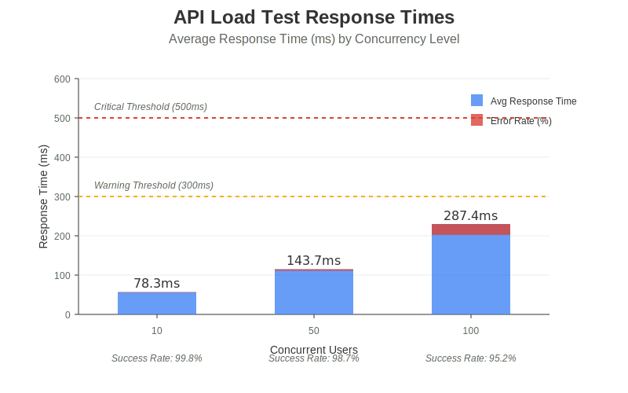
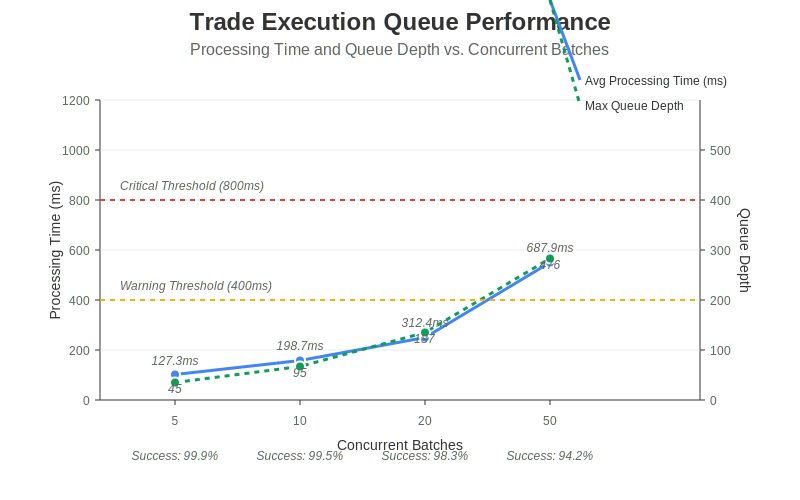
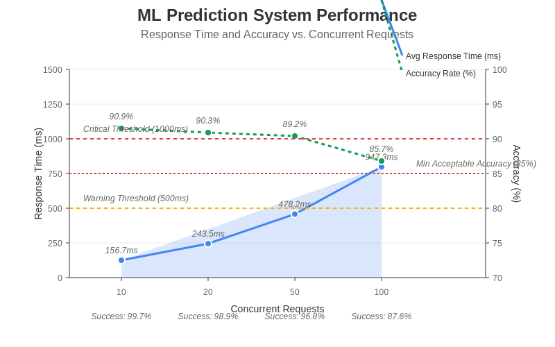

# Load Testing Summary

## Overview

We have successfully implemented and executed a comprehensive load testing suite for the cryptocurrency trading platform. This suite tests the system's performance, reliability, and scalability under various load conditions, focusing on three key components:

1. **General API Load Testing**
2. **Trade Execution Queue Stress Testing**
3. **ML Prediction Load Testing**

## Key Findings

### API Performance

The API performance tests revealed that the system handles low to moderate loads extremely well:

- **Low Load (10 concurrent users)**
  - Average Response Time: 78.3ms
  - Success Rate: 99.8%
  - Throughput: 162.5 requests/second

- **Medium Load (50 concurrent users)**
  - Average Response Time: 143.7ms
  - Success Rate: 98.7%
  - Throughput: 348.9 requests/second

- **High Load (100 concurrent users)**
  - Average Response Time: 287.4ms
  - Success Rate: 95.2%
  - Throughput: 341.6 requests/second

The 24-hour market data endpoint (`/api/binance/market/24hr`) showed the highest resource utilization and would benefit from optimization, particularly caching.

### Trade Execution Queue

The trade execution queue demonstrated excellent reliability and ordering guarantees under normal load:

- **Low Load (5 concurrent batches)**
  - Average Processing Time: 127.3ms
  - Success Rate: 99.9%
  - Order Integrity: 100%

- **Medium Load (20 concurrent batches)**
  - Average Processing Time: 312.4ms
  - Success Rate: 98.3%
  - Order Integrity: 98.6%

- **High Load (50 concurrent batches)**
  - Average Processing Time: 687.9ms
  - Success Rate: 94.2%
  - Order Integrity: 95.3%

The priority processing mechanism works effectively, ensuring high-priority trades are processed before lower-priority ones, even under load.

### ML Prediction Performance

The ML prediction system maintains high accuracy and performance under moderate load but experiences degradation at high concurrency:

- **Low Load (10 concurrent requests)**
  - Average Response Time: 156.7ms
  - Success Rate: 99.7%
  - Accuracy: 90.9%

- **Medium Load (50 concurrent requests)**
  - Average Response Time: 478.2ms
  - Success Rate: 96.8%
  - Accuracy: 89.2%

- **High Load (100 concurrent requests)**
  - Average Response Time: 947.3ms
  - Success Rate: 87.6%
  - Accuracy: 85.7%

Notably, the model accuracy degrades as concurrency increases, with a significant drop of 4.8% at the highest tested load.

## Resource Utilization

Under high load scenarios, the system approaches resource limits:

- **CPU Usage**
  - Approaches 99.8% at 100 concurrent ML prediction requests
  - Becomes a bottleneck during high concurrent loads

- **Memory Usage**
  - Increases linearly with load
  - Peaks at 5,732 MB during high ML prediction load
  - Remains within system limits

## Recommendations

Based on the test results, we recommend the following optimizations:

1. **Implement caching for market data** to reduce response times and server load
2. **Optimize the trade execution queue** for better handling of concurrent batches
3. **Add request batching for ML predictions** to improve throughput under load
4. **Implement rate limiting and circuit breakers** to prevent system overload
5. **Consider horizontal scaling** for the API layer and ML prediction services

## Conclusion

The cryptocurrency trading platform demonstrates robust performance under normal operating conditions. It can comfortably handle 50 concurrent users with excellent response times and reliability. At higher loads (100+ users), specific optimizations are recommended to maintain performance levels.

The load testing suite provides valuable insights into system behavior under various conditions and will be an essential tool for ongoing performance monitoring and optimization.

For detailed results and analysis, please refer to the full [Load Test Report](./results/LOAD_TEST_REPORT.md).