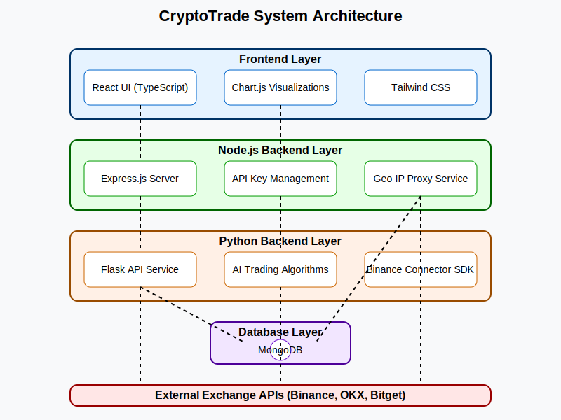
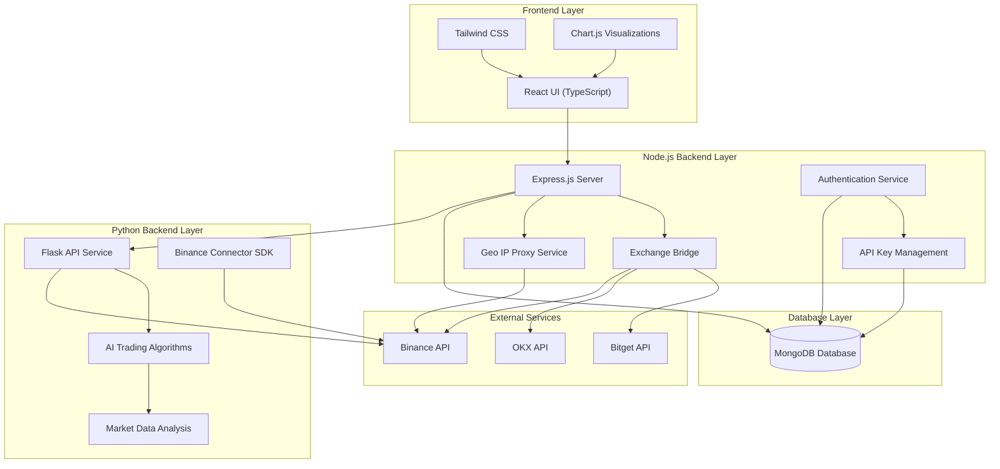

# CryptoTrade System Architecture

This document provides a high-level overview of the CryptoTrade platform architecture, explaining how different components interact.

## System Overview

CryptoTrade uses a hybrid architecture combining Node.js and Python services to deliver a comprehensive cryptocurrency trading platform. The system integrates with multiple exchanges (primarily Binance with OKX as a fallback) and provides various AI-powered trading strategies.

## Architecture Diagram

### Static Diagram

### Interactive Diagram

The following Mermaid diagram provides a more detailed view of the system architecture:

## Component Details

### Frontend Layer

- **React UI**: Client-side application written in TypeScript, providing the user interface for the platform.
- **Tailwind CSS**: Utility-first CSS framework used for styling.
- **Chart.js**: Used for creating interactive data visualizations and charts.

### Node.js Backend Layer

- **Express.js Server**: Core server handling HTTP requests, routing, and middleware.
- **Authentication Service**: Manages user registration, login, and session management.
- **API Key Management**: Securely stores and manages exchange API keys.
- **Geo IP Proxy Service**: Provides proxy functionality for accessing exchange APIs from restricted regions.
- **Exchange Bridge**: Communicates with external exchange APIs (Binance, OKX, Bitget).

### Python Backend Layer

- **Flask API Service**: Python web server exposing API endpoints for AI trading algorithms.
- **AI Trading Algorithms**: Advanced machine learning models for trading strategy optimization.
- **Market Data Analysis**: Data processing and analysis modules.
- **Binance Connector SDK**: Official Binance SDK for reliable API interactions.

### Database Layer

- **MongoDB**: NoSQL database for storing user data, API keys, bot configurations, and trading history.

### External Services

- **Binance API**: Primary source for market data and trading operations.
- **OKX API**: Fallback exchange for market data.
- **Bitget API**: Additional exchange integration.

## Data Flow

1. **User Interaction**:
   - Users interact with the React UI, which makes requests to the Express.js server.

2. **Authentication Flow**:
   - Users register or log in through the Authentication Service.
   - Credentials are verified against the MongoDB database.
   - Sessions are created and managed for authenticated users.

3. **API Key Management**:
   - Users enter exchange API keys through the UI.
   - Keys are encrypted and stored in MongoDB.
   - API Key Management service retrieves and decrypts keys when needed.

4. **Market Data Flow**:
   - Express.js server requests market data from the Exchange Bridge.
   - Exchange Bridge connects to Binance API (primary) or OKX API (fallback).
   - For regions with API restrictions, requests are routed through the Geo IP Proxy Service.

5. **Trading Bot Flow**:
   - Users configure trading bots through the UI.
   - Bot configurations are stored in MongoDB.
   - AI Trading Algorithms analyze market data to optimize trading parameters.
   - Trading decisions are executed through the Exchange Bridge.

6. **Python Service Integration**:
   - Express.js server communicates with the Flask API for AI-specific operations.
   - Flask API uses the Binance Connector SDK for reliable exchange communication.
   - AI models provide trade recommendations based on market analysis.

## Technical Considerations

### Security

- API keys are encrypted using AES-256 before storage.
- All sensitive communications use HTTPS.
- Session-based authentication with secure cookies.

### Scalability

- Stateless architecture allows horizontal scaling.
- MongoDB can be scaled as a replica set.
- Computationally intensive AI operations are isolated in the Python layer.

### Reliability

- Multi-exchange support provides redundancy.
- Fallback mechanisms ensure service availability.
- Comprehensive error handling and logging.

## Deployment Architecture

The system is designed to be deployed as a single unit or as separate services:

1. **Monolithic Deployment**:
   - All services (Node.js, Python, MongoDB) deployed on a single server.
   - Suitable for development and small-scale deployments.

2. **Microservices Deployment**:
   - Node.js and Python services deployed as separate containers.
   - MongoDB deployed as a managed service.
   - Inter-service communication via REST APIs.
   - Suitable for production and large-scale deployments.